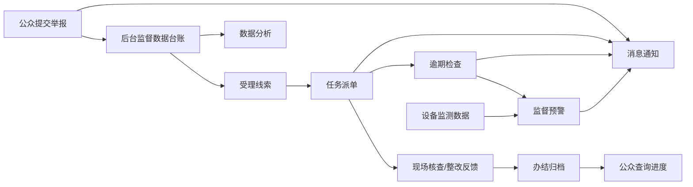

# 环保公众监督系统设计说明

## 技术栈

- 前端：Vue 3、Vite、原生 CSS
- 后端：Spring Boot 3、Spring MVC、MyBatis、springdoc-openapi
- 数据库：H2 文件数据库
- 文件存储：本地 `backend/uploads`

## 系统模块

- 用户权限：登录、角色、菜单权限、后端接口权限
- 区域管理：区域网格、风险等级、责任单位
- 设备对接：设备台账、设备状态、历史趋势
- 监督数据：举报录入、受理、办结、详情、办理时间线、附件证据
- 任务派单：关联举报、负责人、期限、优先级、逾期检查
- 数据分析：指标看板、类型分布、状态分析、区域热度
- 监督预警：人工预警、规则预警、逾期任务预警
- 消息通知：举报、任务、逾期、预警事件的系统提醒
- 公众模块：公告、举报提交、办理进度查询
- 监管地图：设备、举报、预警点位
- 操作日志：关键操作留痕
- 报表导出：举报、任务、预警 CSV

## 业务闭环

## 角色权限

- `ADMIN`：全部模块和全部操作
- `INSPECTOR`：监督数据、任务派单、预警处置、公众模块、地图、通知
- `ANALYST`：数据看板、设备趋势、数据分析、预警查看、公众模块、地图、通知

前端会按角色显示菜单；后端通过 `AuthInterceptor` 解析 `Authorization` token，并对 `/api/**` 业务接口做角色校验。

## 主要数据表

- `user_accounts`：用户账号和角色
- `areas`：区域网格
- `devices`：设备台账
- `device_readings`：设备历史监测数据
- `reports`：公众举报和后台线索
- `report_records`：举报办理记录
- `attachments`：举报证据附件
- `supervision_tasks`：任务派单
- `warnings`：监督预警
- `warning_rules`：预警规则
- `notifications`：系统消息通知
- `map_points`：监管地图点位
- `operation_logs`：操作日志
- `announcements`：公众公告

## 持久化说明

数据库使用 H2 文件模式，文件位于：

`backend/data/env_supervision.mv.db`

上传文件位于：

`backend/uploads/`

初始化 SQL 使用 `CREATE TABLE IF NOT EXISTS` 和 `MERGE INTO`，服务重启不会清空新增业务数据。
